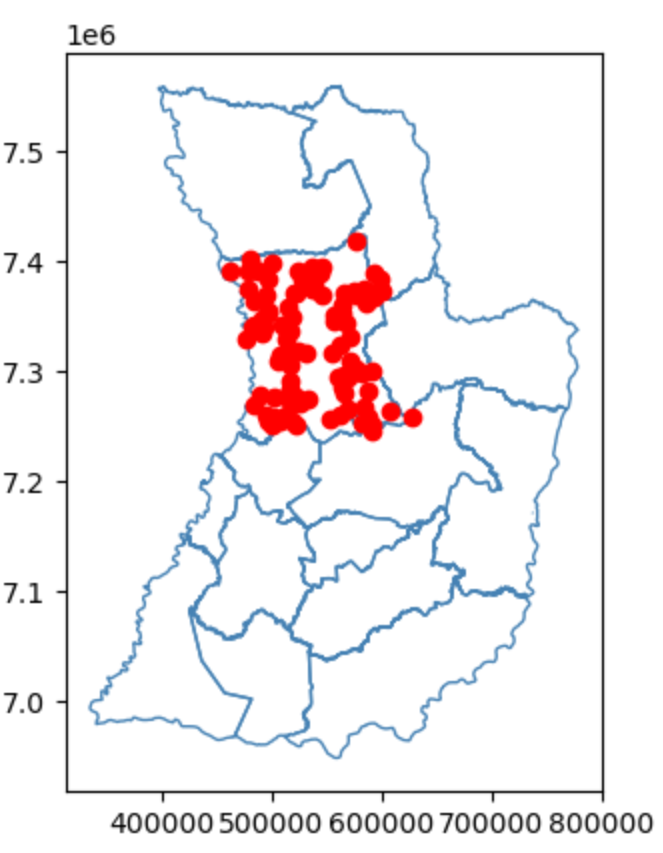
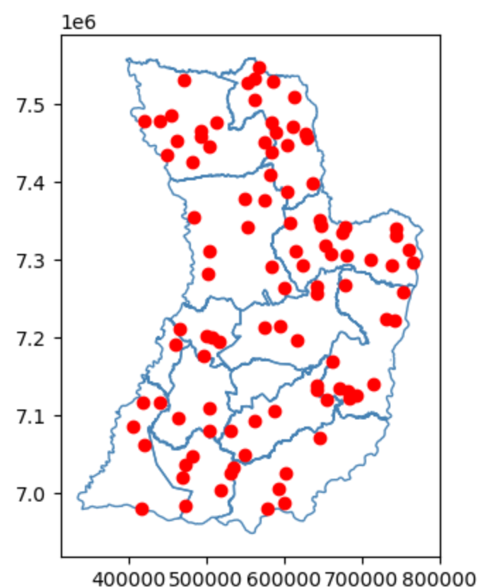
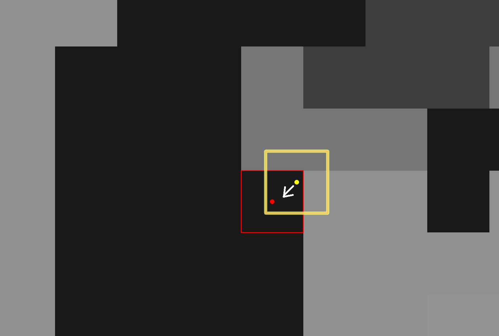

# 

## Generate random sample
sample within subpolygon   | or across full AOI
:-------------------------:|:-------------------------:
  |   

## Shift sample points to centroids of reference grid

## Populate neighbor pixels for contextual information
