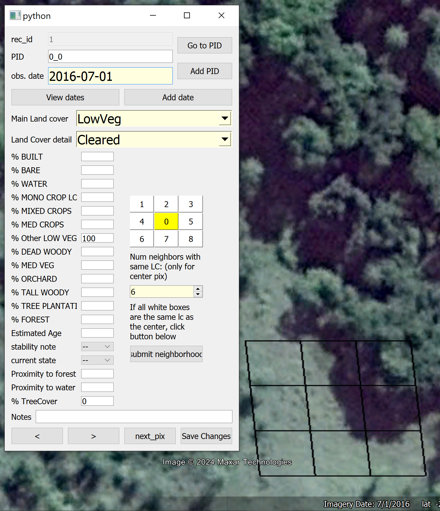
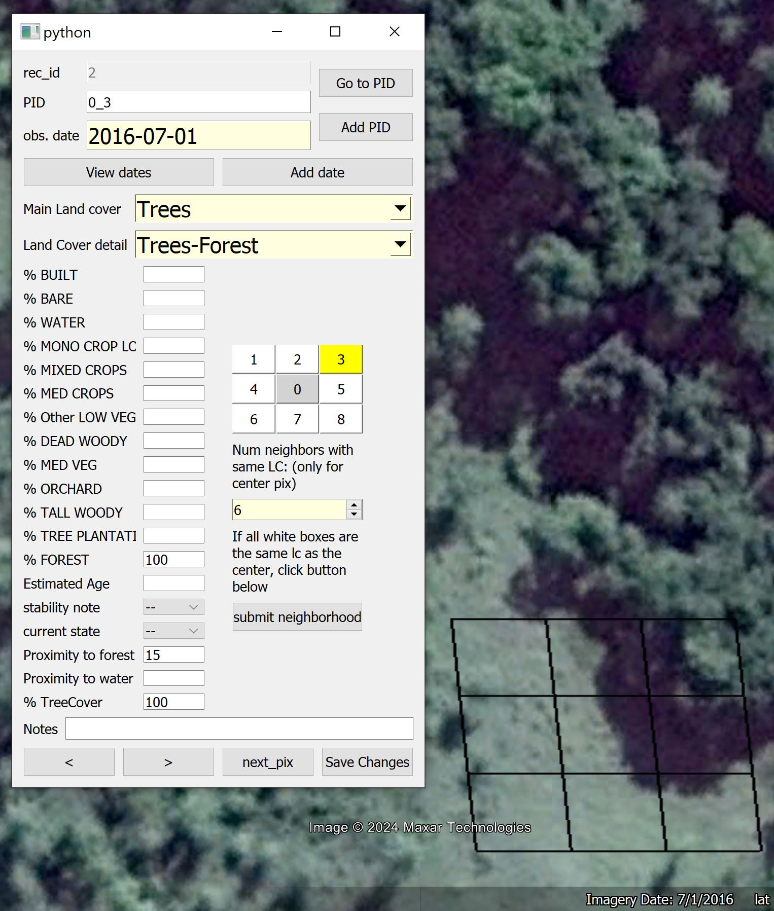
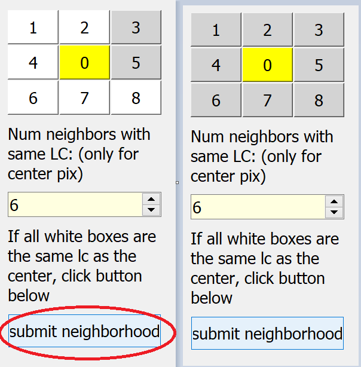
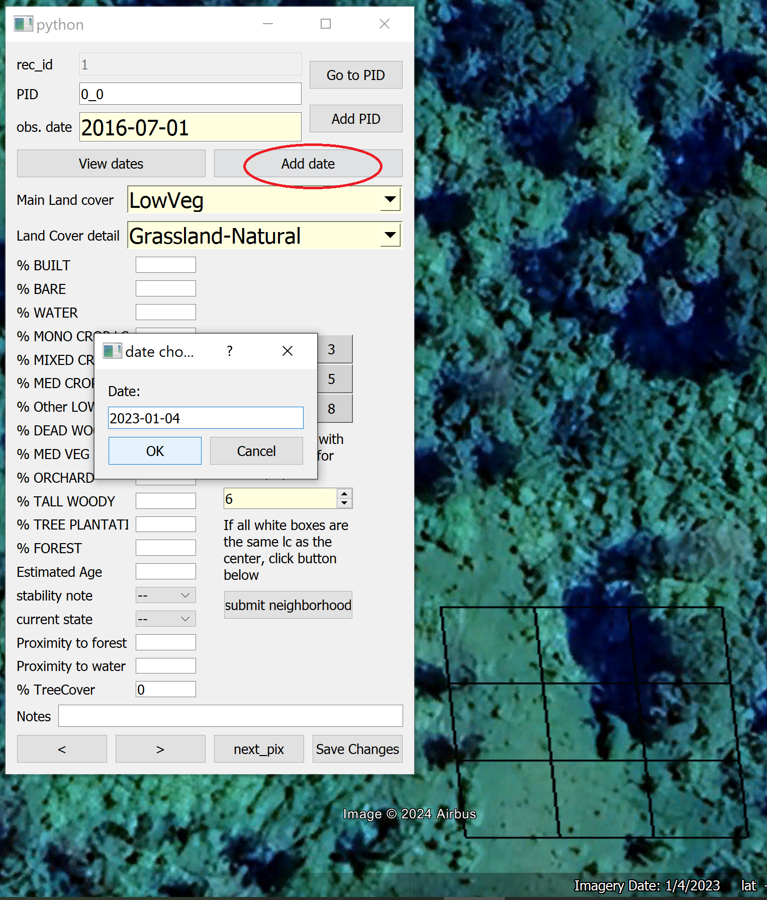
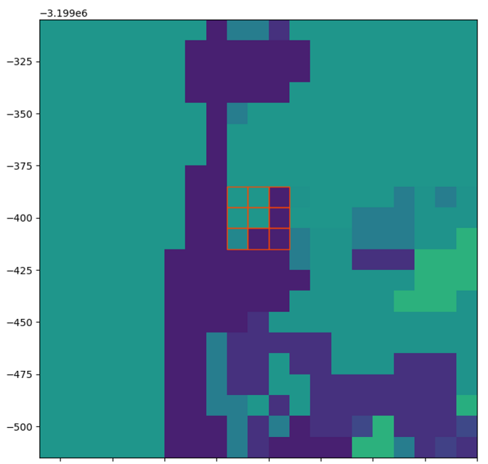

### python & SQLite tool to facilitate collection of land cover training / validation data for time-series analyses over heterogeneous landscapes.

Facilitates efficient capture of data across space and time by automatically copying information from associated records and helping the user to quickly modify areas of change while maintaining a clean data structure. Data between two temporal observations is filled in based on user-defined rules for each land cover (e.g. two forest observations within X years implies forest for all points in time between those observations). This allows for accurate augmentation of the sample set for more powerful training / validation of time-series products.

In addition to expediting the capture of temporal data, CollectCube aids collection of spatial data by using a neighborhood grid around each sample point. This spatial information allows us to:
1) inform landscape heterogeneity metrics
2) provide a confidence measure for pixel classification given positional accuracy measures of the reference data
3) estimate the effect of landscape heterogeneity on product accuracy
4) facilitate training/validation of products at different resolutions (e.g. 10 m Sentinel-based vs. 30 m Landsat-based products)

Within-pixel heterogeneity can also be recorded for the same goals as above and to identify pure pixels (endmembers) for spectral signature and unmixing analyses. 

## Example of CollectCube data input form and process:

|1) Data is entered for the center pixel    | 2) Date is copied and modified for diverging pixels | 3) Center pixel data is then copied to all remaining neighbors.|
|-------------------------|------------------------|-------------------------|
| |  | |
|4) This whole grid is then copied for a new date | Changes can then be made to cells where they occured | | |
| |  |  |

## sample creation 

### Generate random sample

sample within subpolygon   | or across full AOI
:-------------------------:|:-------------------------:
  |   

### Shift sample points to centroids of reference grid

### Populating neighbor pixels for contextual information

## setup for database creation / editing
* conda create --name venv.collect_sql python=3.8
* conda activate venv.collect_sql
* conda install sqlalchemy pyqt5
